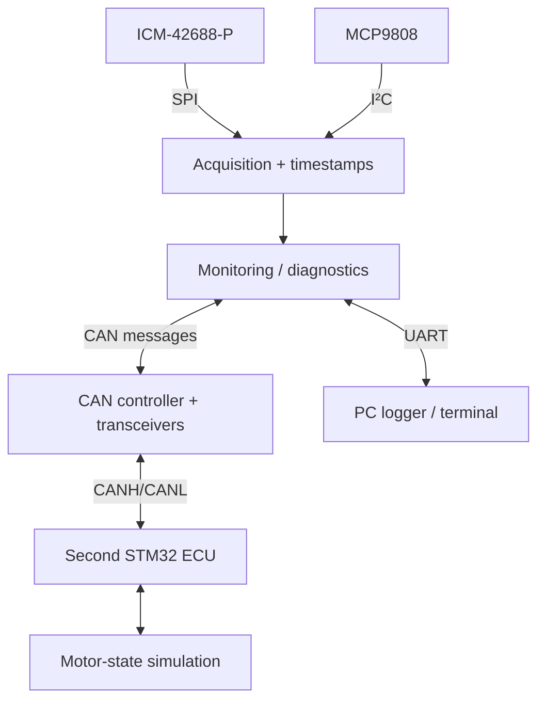

# System architecture

## Scope
Two embedded nodes and a PC. The motor is simulated in firmware for the first milestone. No power stage or physical motor control is included.

## Node 1 — Main monitoring controller
- Acquire IMU data over SPI and temperature over I²C.
- Timestamp and validate measurements.
- Perform monitoring and basic diagnostics.
- Exchange commands/status with Node 2 over CAN.
- Expose a UART console and telemetry stream to the PC.

## Node 2 — Motor controller ECU
- Receive and validate CAN commands.
- Run a deterministic motor-state simulation.
- Publish status, heartbeat and fault information.
- Detect stale commands and enter a defined simulated safe state.

## Data flow

## Modes
BOOT (initialization/self-check), IDLE, MONITOR, DEGRADED and COMMUNICATION_TIMEOUT. Define transitions and timeout thresholds before implementation; do not treat proposed modes as verified behaviour.
