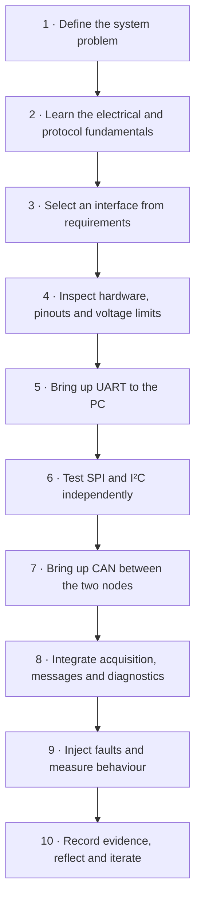

# Embedded Communication & Monitoring Platform

**A hands-on study of SPI, I²C, UART and CAN through one coherent embedded system.**

> **Project status: DESIGN / PROTOTYPE PLANNING.** The architecture and experiments are documented; hardware assembly, firmware execution and physical validation are not yet claimed.

## Why I am building this

As an embedded systems engineer, I want communication interfaces to be more than names I recognize in a schematic or job description. I want to understand what is happening electrically, what the controller is doing, how data is framed and transferred, where failures occur, and how to debug them with instruments and firmware.

The goal is to make SPI, I²C, UART and CAN familiar enough that I can explain them clearly, choose between them from requirements, implement them, inspect their behaviour and recognize common failure modes without treating them as interchangeable buzzwords.

This project is both a practical engineering exercise and a set of open learning notes. I am deliberately putting the fundamentals, design decisions, experiments, observations and mistakes in the repository so that another engineer can follow the same path, reproduce the tests and understand not only **what** I chose, but **why**.

## What I am building

A small two-node STM32 monitoring platform with a PC debug interface. Each interface has a job that makes sense in the system:

| Interface | Project role | Why it belongs here |
|---|---|---|
| **SPI** | IMU to main controller | A clocked local sensor link; useful for studying clock phase, chip select and transfer timing. |
| **I²C** | Temperature sensor to main controller | A low-rate addressed peripheral on a shared two-wire bus; useful for studying ACK/NACK and pull-ups. |
| **UART** | Main controller to PC | A straightforward console/telemetry path; useful for learning framing, buffering and message parsing. |
| **CAN** | Main controller to second ECU | A multi-node control/status link; useful for studying arbitration, identifiers, termination and timeouts. |

The second ECU simulates a motor controller in the first milestone. This keeps the initial project focused on communications, integration and diagnostics rather than introducing motor-power safety and control as additional variables.

## The learning path — follow it in this order

The repository is organized to follow the way I want to learn and build the system: understand the problem first, make a design choice, bring up one interface at a time, then integrate and compare.

### What to do at each stage

1. **Start with the question, not the bus.** What data needs to move? Between which devices? At what rate, over what distance, and under what electrical conditions?
2. **Understand the signal.** Identify wires, voltage levels, clocking, direction, addressing and the role of any transceiver.
3. **Make the interface choice explicit.** Record the requirement that led to the choice and what trade-off it introduces.
4. **Check the real hardware.** Confirm the exact board and module revision, pin mapping, supply range, logic levels and any onboard resistors.
5. **Bring up the simplest path first.** Use UART for a PC console and a repeatable way to report progress and errors.
6. **Prove each local peripheral independently.** Read an IMU register over SPI and a temperature register over I²C before integrating either into the application.
7. **Bring up CAN as a physical bus.** Check the transceivers, wiring, bit timing and termination before debugging application messages.
8. **Integrate deliberately.** Add timestamps, validity flags, sequence counters, timeouts and diagnostic counters.
9. **Make it fail on purpose.** Disconnect a sensor, send malformed UART input, stop a CAN node or create controlled bus-load changes. Record the response.
10. **Write down what happened.** Keep captures and logs with configuration, firmware revision, procedure and limitations. Separate a design expectation from a measured result.

## Protocol quick reference

| If I need to… | First interface to consider | Questions to ask |
|---|---|---|
| Connect a nearby sensor that needs a clocked, potentially fast transfer | SPI | Does the device support the required SPI mode and clock? Can I spare chip-select and data pins? |
| Connect several low-rate peripherals over two shared signal lines | I²C | Are addresses unique? Are pull-ups and bus capacitance suitable? |
| Provide a simple point-to-point debug or module link | UART | What baud and frame format are used? How are message boundaries and malformed input handled? |
| Connect multiple embedded nodes for robust distributed communication | CAN | What are the bus topology, bit rate, termination, identifier plan and timeout behaviour? |

These are starting points, not rules without exceptions. Device capabilities, distance, data rate, noise, power, software support and system-level requirements can change the decision.

## A useful mental model

- **Wires** are the physical path.
- **Electrical signalling** determines how a receiver distinguishes states.
- **Interface/data-link rules** determine how bits are timed, selected, addressed or arbitrated.
- **Application messages** define what the data means, including units, scaling, validity and behaviour on errors.

The terms are not perfectly interchangeable: SPI and I²C describe bus signalling conventions; UART commonly refers to an asynchronous serial peripheral and character framing; CAN defines a data-link protocol and typically needs a separate physical-layer transceiver.

## Repository map

| Path | What belongs there |
|---|---|
| `01_Fundamentals/` | Plain-language concepts and terminology |
| `02_Protocol_Selection/` | Requirements-driven interface comparison |
| `03_System_Architecture/` | Node responsibilities, data flow and system modes |
| `04_Hardware/` | Preliminary BOM, power and wiring checks |
| `05_SPI/` | SPI concepts, implementation notes and experiments |
| `06_I2C/` | I²C concepts, implementation notes and experiments |
| `07_UART/` | UART framing, console and parser experiments |
| `08_CAN/` | CAN physical layer, message map and network experiments |
| `09_Firmware/` | Firmware structure and starter scaffold |
| `10_Integration/` | Ordered bench bring-up |
| `11_Verification/` | Test methods and acceptance criteria |
| `12_Results/` | Evidence and experiment records |
| `13_Iterations/` | Design decisions and changes |
| `images/` | System and workflow diagrams |

## Questions to keep asking

- What requirement does this interface satisfy?
- What is the actual electrical connection, and what voltage does each pin tolerate?
- Who initiates a transfer, and how does the other side know when data is valid?
- Where do message boundaries come from?
- What happens if the peripheral is absent, late, noisy or reset?
- How will I observe the signal independently of my firmware's interpretation?
- What measurement would confirm or disprove my assumption?
- What evidence would another person need to reproduce this result?

More detailed protocol-specific questions are included in each interface folder.

## Frequently asked questions

<strong>Why use all four interfaces in one project?</strong>

Because the aim is to learn their differences in context. Each has a distinct role in this design, so the choice can be explained and tested rather than adding interfaces just to tick a list.

<strong>Are SPI, I²C, UART and CAN directly interchangeable?</strong>

No. They differ in signalling, topology, framing, addressing and fault behaviour. Compare them against a real requirement, not by assigning one universal speed or robustness ranking.

<strong>Is UART itself a complete message protocol?</strong>

UART provides asynchronous serial character framing. It does not automatically define application message boundaries, field meanings or recovery from malformed messages. This project starts with a simple newline-delimited text format and documents its limitations.

<strong>Why does CAN need a transceiver?</strong>

The MCU's CAN/FDCAN peripheral handles protocol functions, but the bus uses differential CANH/CANL electrical signalling. A compatible external transceiver connects the controller to that physical bus.

<strong>Why simulate the motor instead of driving one?</strong>

The first milestone is about communication and system integration. A simulated ECU allows command, status, heartbeat and timeout behaviour to be explored without adding motor-driver design, high current and mechanical safety concerns.

<strong>How will I know which protocol is faster or better?</strong>

There is no meaningful universal winner. Define the payload, rate, topology, implementation and measurement point first. Measure useful throughput, latency, CPU use and error/recovery behaviour under documented conditions. Explain the limitations of each comparison.

<strong>What counts as a verified result?</strong>

A result needs a reproducible procedure and evidence: hardware and firmware revisions, configuration, instrument setup, raw capture or log, observed values and comparison with a predeclared criterion. A successful compile or a plausible diagram is not physical verification.

## Hardware baseline

The current proposal is two STM32 NUCLEO-G474RE boards, an ICM-42688-P IMU breakout, an MCP9808 temperature breakout and two compatible CAN transceiver modules. The BOM and wiring plan are provisional. Verify exact revisions, voltage limits, pin mapping and module circuitry before wiring or powering anything.

## Status and contribution to the learning record

Use **PLANNED**, **DESIGNED**, **IMPLEMENTED**, **VERIFIED**, **MEASURED** and **TBD** consistently. Do not describe planned work as completed. When an experiment is run, add the evidence and conditions to `12_Results/` and update the relevant protocol page with what was learned.

This is a learning and bench-demonstration platform, not a certified safety system or production motor controller.
