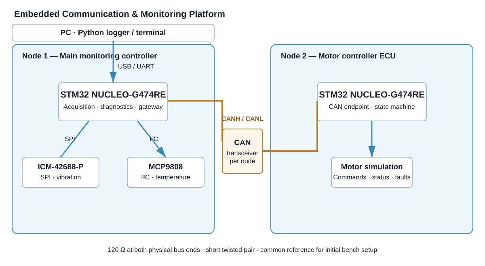
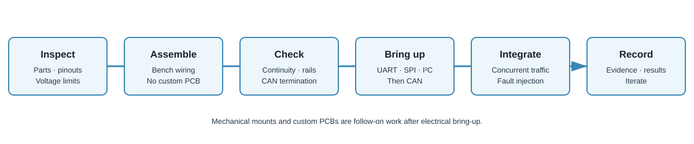

# Embedded Communication & Monitoring Platform

An STM32-based, two-node embedded platform for learning and experimentally evaluating SPI, I²C, UART and CAN in a practical monitoring application.

> **Status: DESIGN / PROTOTYPE PLANNING.** No hardware assembly or physical validation is claimed. Verify exact hardware revisions, pin assignments and electrical limits before energizing the system.

## Why this project?

Each interface has a distinct role, making the system a practical way to learn how interface selection follows requirements rather than fashion.

| Interface | Role | Learning focus |
|---|---|---|
| SPI | ICM-42688-P IMU to main controller | Clocked transfers, chip select, CPOL/CPHA, throughput |
| I²C | MCP9808 temperature sensor to main controller | Addressing, ACK/NACK, shared bus, pull-ups |
| UART | Main controller to PC | Asynchronous framing, baud rate, buffering, application messages |
| Classical CAN | Main controller to motor ECU | Differential physical layer, arbitration, identifiers, timeouts |

This is not a universal protocol benchmark. The goal is to understand trade-offs under defined conditions.

## System architecture

- **Node 1 — Main monitoring controller:** acquires vibration and temperature, performs monitoring/diagnostics, exchanges CAN messages and exposes a UART console.
- **Node 2 — Motor controller ECU:** initially simulates motor state, receives commands and reports status, heartbeat and faults. No physical motor is required for the first milestone.
- **PC:** logs and visualizes data through the board's USB/ST-LINK virtual COM port, where supported.

The STM32 FDCAN peripheral requires an external CAN transceiver to connect to CANH/CANL. The controller and transceiver are separate components.

## Initial hardware baseline

| Qty | Item | Notes |
|---:|---|---|
| 2 | STM32 NUCLEO-G474RE | Verify board revision, FDCAN and UART routing |
| 1 | ICM-42688-P breakout | Verify supply, logic level and SPI support |
| 1 | MCP9808 breakout | Verify supply, address straps and pull-ups |
| 2 | CAN transceiver modules | Verify exact circuit, pinout, supply and termination |
| 2 | USB cables | Board power/programming |
| 1 set | Jumper wires | Initial bench wiring |
| 1 | Twisted pair | Short CAN bus |
| 2 | 120 Ω resistors | One at each physical end, unless built-in selectable termination is present |
| 1 | Multimeter | Continuity and voltage checks |
| 1 | Logic analyzer | SPI/I²C/UART observation; not a substitute for a CAN analyzer |

Hardware is provisional. Record exact vendor, part number, revision and datasheet for purchased modules. Do not assume module connector labels guarantee voltage compatibility.

## Repository structure

- `01_Fundamentals/` — terminology and interface concepts
- `02_Protocol_Selection/` — requirements-driven comparison
- `03_System_Architecture/` — nodes, responsibilities and data flow
- `04_Hardware/` — BOM, power and wiring checks
- `05_SPI/`, `06_I2C/`, `07_UART/`, `08_CAN/` — protocol notes and experiments
- `09_Firmware/` — firmware architecture and scaffold
- `10_Integration/` — staged bring-up
- `11_Verification/` — verification plan
- `12_Results/` — evidence and results template
- `13_Iterations/` — design decisions and revisions
- `images/` — diagrams

## Build sequence

1. Inspect boards/modules and verify pinouts, voltage limits and revisions.
2. Bring up the main board and UART link.
3. Test SPI IMU access and I²C sensor access independently.
4. Bring up the second board and the terminated CAN bench bus.
5. Verify CAN heartbeat and command/status exchange.
6. Integrate acquisition and diagnostics; run repeatable experiments.
7. Consider mechanical mounts or custom PCBs only after electrical bring-up.

## Status and evidence

Use **PLANNED**, **DESIGNED**, **IMPLEMENTED**, **VERIFIED**, **MEASURED** and **TBD** consistently. Do not claim a test passed or a value was measured without evidence. Record firmware commit, hardware revision, instrument setup, raw capture/log, procedure, result and deviations.

## Safety and scope

This is a low-voltage bench demonstrator, not a certified motor controller or safety system. Keep the physical motor out of the first milestone. A future motor stage requires a separate design for current limiting, emergency stop, thermal limits and safe-state behaviour.

No license has been selected yet; add one when reuse and distribution terms are decided.
